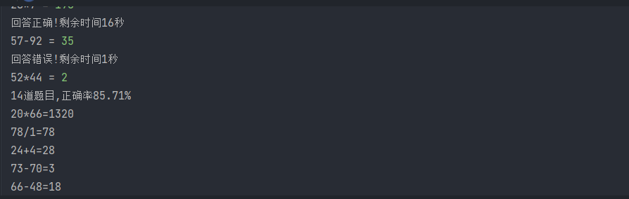

# 一分钟数学运算

## 项目需求

* 直接在控制台使用命令行运行
* 程序运行之后倒计时1分钟之后结束
* 随机出100以内的2个整数加减乘除运算题目（除法确保能够除尽，但除数不能为0）
* 每出一道题目，由玩家给出答案，然后程序判断对错，接着出下一题，并且显示剩余时间
* 1分钟时间结束，显示总题数和正确率（正确率精确到小数点后2位），并将之前的题目和答案显示出来

## 运行结果

## 小总结

* 格式化字符串输出 .format()
* 循环 while
* 条件判断 if
* 列表 l = []
* 异常处理 try: except:
* 自定义函数 def get_divisor(n)
* 时间工具包 import time  -->
  * time.time() 当前时间
* 随机工具包 import random -->
  * random.choice() 从当前列表当中随机选择
  * random.randint() 范围中随机整数
